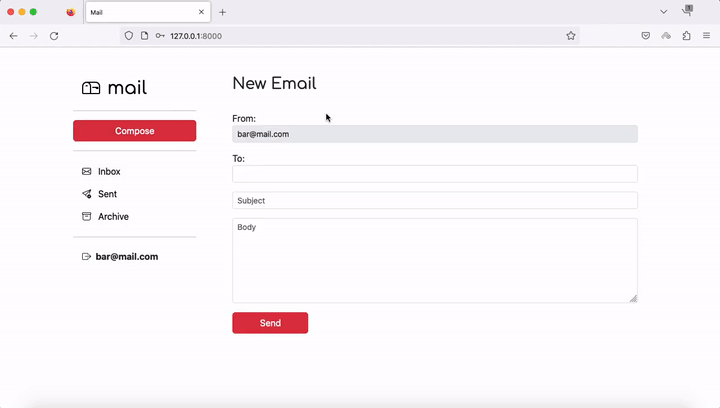
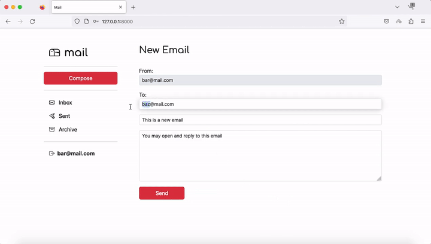
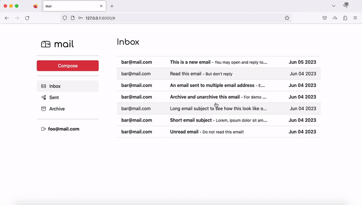
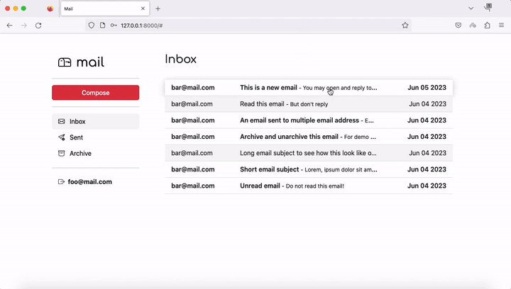
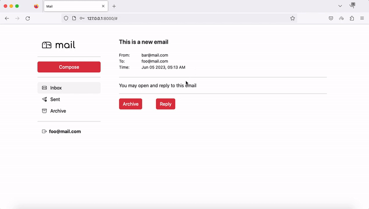
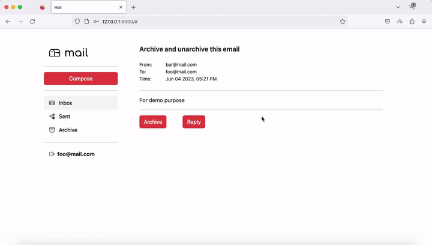
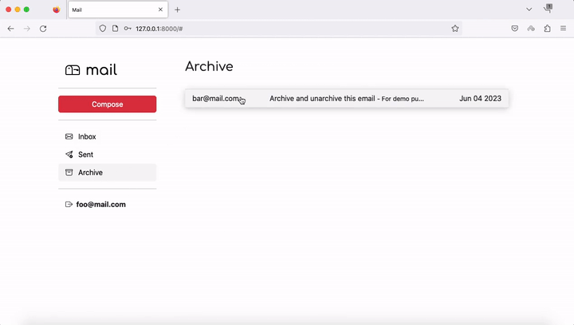

# Mail
### [Video Demo](https://www.youtube.com/watch?v=roNlDxW3WNM&feature=youtu.be)
### Description: A single-page email client that makes API calls with Javascript to send and receive emails.

# Specification
1. Login and register user.

2. Send Mail: When a user submits the email composition form, add JavaScript code to actually send the email.
    - Show an error message if the user try to send an email to invalid email address.
    - 
    - Once the email has been sent to a valid email address, load the user’s sent mailbox.
    -   
      

3. Mailbox: When a user visits their Inbox, Sent mailbox, or Archive, load the appropriate mailbox.

    - If the email is unread, it should appear with a white background. If the email has been read, it should appear with a gray background.
    - 
      

4. View Email: When a user clicks on an email, the user should be taken to a view where they see the content of that email.

5. Reply: Allow users to reply to an email.
    - When the user clicks the “Reply” button, they should be taken to the email composition form. Each composition form should be pre-filled with the content of the email, with an additional line of something like "On Jan 1 2020, 12:00 AM foo@example.com wrote:" on the email body.
    - 
      

6. Archive and Unarchive: Allow users to archive and unarchive emails that they have received. Once an email has been archived or unarchived, load the user’s inbox. This requirement does not apply to emails in the Sent mailbox.
    - When viewing an Inbox email, the user should be presented with a button that lets them archive the email. 
    - 
    - When viewing an Archive email, the user should be presented with a button that lets them unarchive the email. 
    